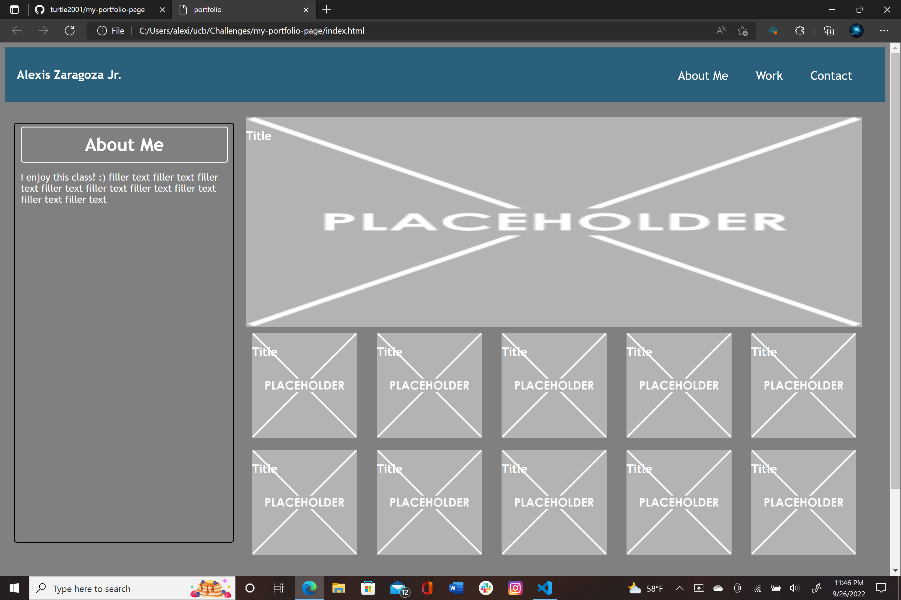

# My Portfolio Page

## Description 

This project was to create my own portfolio website. I used the things that I have learned so far to build this website frmo scratch so that I could display my current and future projects for future employers to see.

## [Webpage](https://github.com/turtle2001/my-portfolio-page)


## Code Snippet
```html
.projects {
    display: flex;
    flex-direction: row;
    justify-content: space-between;
    height: var(--main-height);
    width: 70%;
    border-radius: 5px;
    margin: 5px;
    flex-wrap: wrap;
}
```

## Author Links
[LinkedIn](https://www.linkedin.com/in/alexis-zaragoza-5baa51242/)
[GitHub](https://github.com/turtle2001)